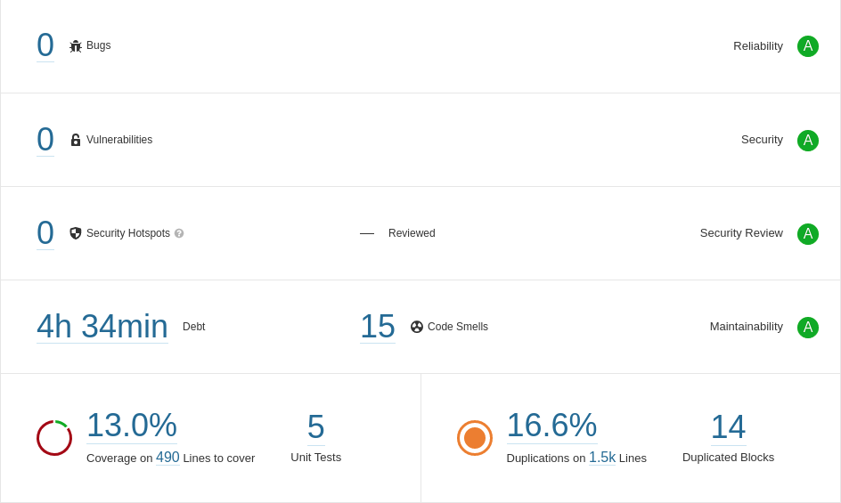

<h1 align="center"><a id="user-content---sobre-o-projeto-" class="anchor" aria-hidden="true" href="#--sobre-o-projeto-"><svg class="octicon octicon-link" viewBox="0 0 16 16" version="1.1" width="16" height="16" aria-hidden="true"><path fill-rule="evenodd" d="M7.775 3.275a.75.75 0 001.06 1.06l1.25-1.25a2 2 0 112.83 2.83l-2.5 2.5a2 2 0 01-2.83 0 .75.75 0 00-1.06 1.06 3.5 3.5 0 004.95 0l2.5-2.5a3.5 3.5 0 00-4.95-4.95l-1.25 1.25zm-4.69 9.64a2 2 0 010-2.83l2.5-2.5a2 2 0 012.83 0 .75.75 0 001.06-1.06 3.5 3.5 0 00-4.95 0l-2.5 2.5a3.5 3.5 0 004.95 4.95l1.25-1.25a.75.75 0 00-1.06-1.06l-1.25 1.25a2 2 0 01-2.83 0z"></path></svg></a> <g-emoji class="g-emoji" alias="computer" fallback-src="https://github.githubassets.com/images/icons/emoji/unicode/1f4bb.png"></g-emoji> About </h1>

<div align="center">


</div>

# People Registration

## People registration system, developed during studies of the spring ecosystem and web technologies, using MVC design pattern. I also improved my knowledge in unit testing (Junit and mockito), integration testing (Junit) and E2E testing with BDD (Selenium and Jbehave). 

---

Content table
=================
* [About](#about)
* [Content table](#content-table)
* [Project Status](#project-status)
* [Architecture model](#architecture-model)
* [Features](#features)
* [Getting started](#getting-started)
* [Run tests](#run-tests)
* [Sonar metrics](#sonar-metrics)
* [Techs](#techs)
* [Author](#author)

---
### Project Status
<h4 align="center"> 
	🚧  Project under development...  🚧
</h4>

---

### Architecture model


---

### Features
- [x] Person CRUD
- [x] Person phones CRUD
- [x] Register person curriculum (pdf)
- [x] Download person curriculum
- [x] Filter people by gender
- [x] Filter people by name content
- [x] Download report people by filter


---
### Getting started

```bash
# Clone repository
$ git clone <https://github.com/eduardowanderleydev/people-registration-springMVC.git>

# go to project directory
$ cd personregistration

# run application
$ mvn spring-boot:run

# The server will start on port:8080
```


---
### Run Tests

```bash
# go to project directory
$ cd personregistration

# run tests
$ mvn clean test
```

---
### Sonar metrics



---
### Techs
The following technologies were used in the construction of the project:

Backend
- [Spring boot](https://spring.io/projects/spring-boot)
- [Spring security](https://spring.io/projects/spring-security)
- [Spring Data JPA](https://spring.io/projects/spring-data-jpa)
- [H2 Database](https://www.h2database.com/html/main.html)
- [Jasper Reports](https://reportserver.net/en/documentation/)

Frontend
- [HTML5](https://pt.wikipedia.org/wiki/HTML5)
- [Thymeleaf](https://www.thymeleaf.org/documentation.html)
- [Javascript](https://developer.mozilla.org/pt-BR/docs/Web/JavaScript)
- [JQuery](https://api.jquery.com/)
- [Materialize Design](https://materializecss.com/)

Tests and metrics
- [Junit4](https://junit.org/junit4/javadoc/4.13/overview-summary.html)
- [Mockito](https://javadoc.io/doc/org.mockito/mockito-core/latest/org/mockito/Mockito.html)
- [Selenium](https://www.selenium.dev/selenium/docs/api/py/api.html)
- [Jbehave](https://jbehave.org/)
- [SonarQube](https://docs.sonarqube.org/latest/)
- [Jacoco](https://www.jacoco.org/jacoco/trunk/doc/)

---
### Author
<a href="https://github.com/eduardowanderleydev">
 
 <br />
 <sub><b>Eduardo Wanderley</b></sub></a>


Contact : 👋🏽

[](https://www.linkedin.com/in/eduardowanderleydev/)
[](mailto:eduardowanderleydev@gmail.com)
[](https://github.com/eduardowanderleydev)
